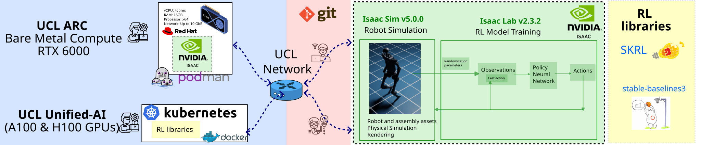

# {.title-slide .centeredslide background-iframe="https://mxochicale.github.io/web-animations/" loading="lazy"}

::: {style="background-color: rgba(22,22,22,0.75); 
  border-radius: 10px; 
  text-align:center; 
  padding: 0px; 
  padding-left: 1.5em; 
  padding-right: 1.5em; 
  max-width: min-content; 
  min-width: max-content; 
  margin-left: auto; 
  margin-right: auto; 
  padding-top: 0.2em; 
  padding-bottom: 0.2em; 
  line-height: 1.5em!important;"}


<span style="color:#939393; font-size:1.75em; text-align:left; display:block;">

[Modernising Robotics Skills   
for Collaborative Science]{style="color:#e0e0e0; font-size:1.65em; display:block; font-weight:600;"}

<!-- 
Distributed Intelligence, Cloud Computing, and Sensor-Driven Discovery Across Networked Systems
-->

</span>  

---

[ [**Miguel Xochicale**](http://name-surname.github.io/) · [UCL Advanced Research Computing](https://www.ucl.ac.uk/advanced-research-computing/)]{style="font-size:0.55em; color:#aaaaaa;"}  


:::


::: footer
[Q1-2026 [(web-animations 2025 by mxochicale)](https://mxochicale.github.io/web-animations/)]{.dim-text style="text-align:left;'}
:::

::: {.notes}
  [[`open-healthcare-slides`](https://github.com/mxochicale/physical-ai-in-healthcare-slides/)]{style="border-bottom: 0.5px solid #00ccff;"}
:::


<!-- ============================================================
     OVERVIEW
     ============================================================ -->
## Overview {.smaller}

:::: {.columns}

::: {.column width="50%"}
### What We'll Cover

1. **Introduction** — Modernising robotics skills at UCL
2. **UCL Infrastructure** — Cloud, network & physical layers
3. **Demonstrations** — Real use cases & live tooling
4. **Future Work** — Next hackathons & calls to action
:::

::: {.column width="50%"}
### Key Themes

::: {.callout-note icon=false}
## :cloud: Cloud-native robotics
Kubernetes, Terraform, container registries
:::

::: {.callout-tip icon=false}
## :robot: Simulation at scale
IsaacSim, IsaacLab, reinforcement learning
:::

::: {.callout-important icon=false}
## :busts_in_silhouette: Collaborative science
Cross-department infrastructure, shared testbeds
:::
:::

::::


<!-- ============================================================
     SECTION: INTRODUCTION
     ============================================================ -->
# Introduction {#Introduction background-color="#1a1a2e"}
**Modernising Robotics Skills**

::: {.notes}
Set the scene: why does UCL need modernised robotics infrastructure? 
The challenge is bridging simulation, cloud compute, and real sensors 
in a way that's accessible to researchers and students.
:::


<!-- ============================================================ -->
## :wrench: Hacking Cloud Brains, Physical Sensors, and the Network, and Orchestrating Talent

::: {#fig-hackathon}
{fig-align="center" width="90%"}

*Participants working across cyber-physical systems, cloud layers, and sensor networks at UCL Here East.*
:::

::: {.notes}
Describe the hackathon format: participants connected VMs, physical sensors, 
and cloud nodes in a supervised setting. This became the model for scaling 
robotics education at UCL.
:::

<!-- ============================================================
     SECTION: UCL INFRASTRUCTURE
     ============================================================ -->
# UCL Infrastructure {#ucl-infrastructure background-color="#0d1b2a"}
**Orchestrating Cloud, Network, and Physical Sensors**

::: {.notes}
Walk through the three layers: cloud VMs managed via Terraform/k8s, 
the campus network, and physical hardware (sensors, robots).
:::


<!-- ============================================================ -->
## :robot: UCL’s cyber-physical infrastructure

::: {#fig-network}
{fig-align="center" width="88%"}

*Server topology and network communication across UCL's cyber-physical infrastructure.*
:::


::: {.notes}
Key point: the infrastructure is reproducible. Terraform configs and container 
images are versioned on GitHub, so any team can spin up the same environment.

::: {.callout-tip collapse="true"}
## Infrastructure Stack
- **Compute**: VMs managed with Terraform + Kubernetes (k8s)  
- **Containers**: ROS 2 images via GitHub Container Registry  
- **Middleware**: `zenoh-plugin-ros2dds` for VM↔VM and bare-metal↔VM bridging  
- **Networking**: High-performance campus fabric, 10 Gbps+ links
:::

:::


<!-- ============================================================ -->
## :robot: UCL: sim2real-humanoid-pipeline

::: {#fig-network}
{fig-align="center" width="88%"}

*UCL-ARC infrastructure, integrating simulators such as Isaac Lab with reinforcement learning frameworks and algorithms (skrl and stable-baselines3) to support scalable, distributed training and deployment workflows.*
:::


<!-- ============================================================
     SECTION: DEMOS
     ============================================================ -->
# Demonstrations {#demos background-color="#0f2027"}
**Cloud Brains · Physical Sensors · Real Networks**

::: {.notes}
Three demos: (1) VM-to-VM ROS 2 comms via zenoh, 
(2) IsaacSim interactive control, (3) IsaacLab RL training at scale.
:::


<!-- ============================================================ -->
## Demo 1. VM↔VM Communication with `zenoh-plugin-ros2dds` {.smaller}

:::: {.columns}

::: {.column width="35%"}
### What Was Built

- ROS 2 Docker container pushed to GitHub Container Registry
- VMs provisioned and torn down with **Terraform + k8s**
- `zenoh-plugin-ros2dds` bridges DDS traffic across VM boundaries
- Enables bare-metal ↔ VM and VM ↔ VM ROS 2 topic sharing with **zero config changes** on the robot side


:::

::: {.column width="65%"}
::: {#fig-pipeline}
{fig-align="center"}

*End-to-end pipeline: container build → registry → VM deployment → zenoh bridge → ROS 2 topic relay.*
:::
:::

::::

::: {.notes}
Emphasise that the zenoh bridge makes the infrastructure topology transparent 
to application code. ROS 2 nodes don't need to know they're crossing VM boundaries.

::: {.callout-note icon=false}
**Repo**: [UCL-CyberPhysicalSystems/hackathon-01](https://github.com/UCL-CyberPhysicalSystems/hackathon-01)
:::

:::


<!-- ============================================================ -->
## Demo 2. IsaacSim & IsaacLab {.smaller}

:::: {.columns}

::: {.column width="38%"}

::: {#fig-isaacsim}
{fig-align="center" width="70%"}

*IsaacSim IDE: interactive robot key control.*
:::

::: {#fig-franka}
{fig-align="center" width="70%"}

*Franka Lift Cube — RL policy training.*
:::

:::

::: {.column width="60%"}

::: {#fig-humanoid-train}
{fig-align="center" width="70%"}

*Humanoid training — 128 parallel environments, 2000 iterations.*
:::

```{.bash code-line-numbers="false"}
# Train
./isaaclab.sh -p scripts/reinforcement_learning/rsl_rl/train.py \
  --task Isaac-Humanoid-v0 --num_envs 128 \
  --max_iterations 2000 --headless

# Play / evaluate
./isaaclab.sh -p scripts/reinforcement_learning/rsl_rl/play.py \
  --task Isaac-Humanoid-v0 --num_envs 1000 \
  --checkpoint logs/rsl_rl/humanoid
```

:::

::::

::: {.notes}
IsaacLab unlocks GPU-parallelised RL training on UCL's compute nodes. 
Highlight the jump from 128 envs (training) to 1000 envs (evaluation) 
as evidence of the infrastructure's headroom.


{fig-align=center}

./isaaclab.sh -p scripts/reinforcement_learning/rsl_rl/train.py --task Isaac-Humanoid-v0 --num_envs 128 --max_iterations 2000 --headless

{fig-align=center}

./isaaclab.sh -p scripts/reinforcement_learning/rsl_rl/play.py --task Isaac-Humanoid-v0 --num_envs 1000 --checkpoint logs/rsl_rl/humanoid


:::


<!-- ============================================================
     SECTION: FUTURE WORK & TAKEAWAYS
     ============================================================ -->
# Future Work & Key Takeaways {#tacfa background-color="#1a1a2e"}

::: {.notes}
Wrap up: upcoming hackathons, what the community should take away, 
and a concrete call to action for collaboration and funding.
:::


<!-- ============================================================ -->
## Upcoming Hackathons {.smaller}

:::: {.columns}

::: {.column width="40%"}

::: {.callout-important icon=false}
## :calendar: Hackathon 1 — **2 March 2026**
**Preliminary Small Hackathon**  
Feasibility testing & idea generation  
📍 UCL Here East, Room G40
:::

::: {.callout-tip icon=false}
## :calendar: Hackathon 2 — **Q4 2026**
**Larger Collaborative Hackathon**  
Explore ideas · Create research projects  
📍 TBC
:::

[**Register / follow progress →**](https://github.com/UCL-CyberPhysicalSystems/hackathon-01)
:::

::: {.column width="60%"}
::: {#fig-future-network}
{fig-align="center" width="95%"}

*The same infrastructure will underpin both hackathons.*
:::
:::

::::

::: {.notes}
Hackathon 1 is a low-stakes day to validate the setup with a small group. 
Hackathon 2 opens it to a much larger audience with external collaborators.
:::


<!-- ============================================================ -->
## Key Takeaways

::: {style="font-size: 90%;"}

::: {.incremental}
- **:unlock: Lowering the barrier to advanced robotics**
Cloud-ready, cost-aware infrastructure enables hands-on training with real sensors and real network constraints, without specialist hardware budgets.
  
- **:arrows_counterclockwise: A proven, scalable model for collaboration**
High-performance networking and shared platforms make cross-department and cross-institution work practical and repeatable.

- **:test_tube: A living testbed for research & training**
The infrastructure supports skills transfer, rapid prototyping of robotics workflows, and publishable research experiments.

- **:handshake: Call to Action**
Partner with us to extend the testbed. We are actively seeking collaboration and funding to scale training, expand use cases, and deploy beyond UCL.
:::


:::

::: {.notes}
Deliver these one at a time with the incremental reveal. 
End on the call to action — have contact details ready.


1. Lowering the Barrier to Advanced Robotics
2. A Scalable Model for Cross-Department Collaboration
3. Real Sensors, Real Networks, Real Constraints
4. High-Performance Networking Enables New Workflows
5. Cloud-Ready Robotics Training at Scale
6. Hands-On Learning Accelerates Skills Transfer
7. Cost-Aware, Sustainable Infrastructure Design
8. A Testbed for Research, Training, and Innovation
9. Clear Opportunities for Collaboration & Funding

**Sciortino et al. 2017** in Computers in Biology and Medicine https://doi.org/10.1016/j.compbiomed.2017.01.008;      
**He et al. 2021** in Front. Med. https://doi.org/10.3389/fmed.2021.729978

:::


<!-- ============================================================ -->
## Thank You · Let's Connect {.smaller}

:::: {.columns}

::: {.column width="50%"}
### UCL CEGE
[Mickey Li](https://github.com/mhl787156) ·
[Chris Bendkowski](https://github.com/ctbend)

### UCL ARC
[Marlon Wijeyasinghe](https://github.com/mwij02) ·
[James Legg](https://github.com/cjlegg) ·
[Mack Nixon](https://github.com/TOADD) ·
[Mahmoud Abdelrazek](https://github.com/TOADD) ·
[Sunny Park](https://github.com/TOADD) ·
[Emily Dubrovska](https://github.com/pineapple-cat) ·
[Yagmur Ozdemir](https://github.com/yidilozdemir) ·
[Ruaridh Gollifer](https://github.com/ruaridhg) ·
[Samantha Ahern](https://github.com/quirksahern) ·
[James Hetherington](https://github.com/jamespjh)
:::

::: {.column width="50%"}
### Teams

**Unified-AI**: Andrew Esterson · Sylvie Ramos  
**Condenser**: Sam Reece · Brian Maher

---

::: {.callout-note icon=false}
## :speech_balloon: Get in Touch
**GitHub**: [github.com/mxochicale](https://github.com/mxochicale)  
**UCL ARC**: [ucl.ac.uk/arc](https://www.ucl.ac.uk/arc)  
**Hackathon repo**: [UCL-CyberPhysicalSystems/hackathon-01](https://github.com/UCL-CyberPhysicalSystems/hackathon-01)
:::
:::

::::

::: {.notes}
Thank the room. Leave the slide up during questions — 
GitHub handle and repo URL are visible for anyone who wants to follow up.
:::


<!-- ============================================================
     EXTRA SLIDES (appendix)
     ============================================================ -->
# Appendix {background-color="#111111"}

Extra slides for Q&A


<!-- ============================================================ -->
## My Journey {#sec-mt .smaller}

{fig-align="center" width="100%"}

::: {.notes}
Use this slide if asked about background — brief overview of the path 
from robotics research to ARC infrastructure work.
:::
