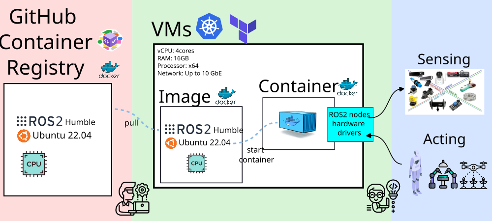
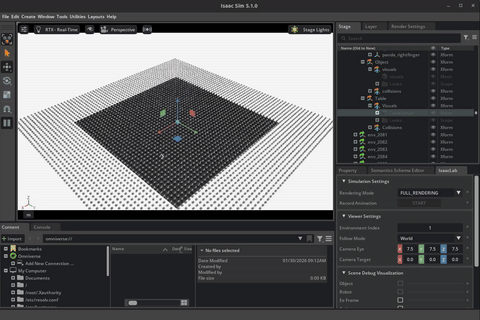

# {.title-slide .centeredslide background-iframe="https://mxochicale.github.io/web-animations/" loading="lazy"}

::: {style="background-color: rgba(22,22,22,0.75); 
  border-radius: 10px; 
  text-align:center; 
  padding: 0px; 
  padding-left: 1.5em; 
  padding-right: 1.5em; 
  max-width: min-content; 
  min-width: max-content; 
  margin-left: auto; 
  margin-right: auto; 
  padding-top: 0.2em; 
  padding-bottom: 0.2em; 
  line-height: 1.5em!important;"}

Modernising Robotics Skills for Collaborative Science  
through In-House Infrastructure
<!-- 
Distributed Intelligence, Cloud Computing, and Sensor-Driven Discovery Across Networked Systems
-->

  

[
Miguel Xochicale     
[](http://name-surname.github.io/) UCL-ARC    
]{style="font-size:0.55em;"}

:::

::: footer
[Q1-2026 [(web-animations 2025 by mxochicale)](https://mxochicale.github.io/web-animations/)]{.dim-text style="text-align:left;'}
:::

::: {.notes}
  [[`open-healthcare-slides`](https://github.com/mxochicale/physical-ai-in-healthcare-slides/)]{style="border-bottom: 0.5px solid #00ccff;"}
:::

<!-- *********************** NEW SLIDE *********************** -->
# Overview {style="font-size: 60%;"} 

* [Introduction](#Introduction)
* [UCL Infrastructure](#ucl-nfrastructure)
* [Demonstrations and Use Cases](#demos)
* [Future work, Key Takeaways, Calls to Action and Acknowledgements](#tacfa)

<!--  Comments -->
<!--  * [Open-Source Software in Healthcare](#sec-ossh) -->

<!-- *********************** NEW SLIDE *********************** -->
# Introduction {#Introduction}
Modernizing Robotics Skills

::: {.notes}
  Notes goes here
:::

<!-- *********************** NEW SLIDE *********************** -->
## :wrench: Hacking Cloud Brains, Physical Sensors, and the Network, and Orchestrating Talent

::: {#fig-template}

{fig-align=center}

Cyber physical systems, cloud layer and participants
:::

::: {.notes}
Speaker notes go here.
:::

<!-- *********************** NEW SLIDE *********************** -->
# UCL Infrastructure {#ucl-nfrastructure}
Orchestrating Cloud Brains, Physical Sensors, and the Network   

::: {.notes}
  Notes goes here
:::

<!-- *********************** NEW SLIDE *********************** -->
## :robot: Orchestrating UCL infrastructure

::: {#fig-template}

{fig-align=center}

Servers in UCL infrastructure and their network communication
:::

::: {.notes}
Speaker notes go here.
:::

<!-- *********************** NEW SLIDE *********************** -->
# Demos {#demos}
Orchestrating Cloud Brains, Physical Sensors, and the Network

::: {.notes}
  Notes goes here
:::

<!-- *********************** NEW SLIDE *********************** -->
## Demos: VM↔VM and Bare-metal↔VM Communication with `zenoh-plugin-ros2dds`

:::: {.columns}

::: {.column width="35%"}

* Docker container with ROS2 dependencies
* Github Container Registry
* VMs managed with terraform and kubernetes (k8s)

:::

::: {.column width="65%"}

::: {#fig-template}
{fig-align=center}

Hacking and connecting workflow
:::

:::

::::

::: {.notes}
Speaker notes go here.
:::

<!-- *********************** NEW SLIDE *********************** -->
## Demos: IsaacSim and IsaacLab

:::: {.columns}

::: {.column style="width: 35%; font-size: 30%;"}

::: {#fig-template}

{fig-align=center}

IsaacSim IDE with robot simple key control
:::

::: {#fig-template}

{fig-align=center}

Franka Lift Cube (RL Training)
:::

:::

::: {.column style="width: 60%; font-size: 30%;"}

::: {#fig-template}
{fig-align=center}

./isaaclab.sh -p scripts/reinforcement_learning/rsl_rl/train.py --task Isaac-Humanoid-v0 --num_envs 128 --max_iterations 2000 --headless

:::

::: {#fig-template}
{fig-align=center}

./isaaclab.sh -p scripts/reinforcement_learning/rsl_rl/play.py --task Isaac-Humanoid-v0 --num_envs 1000 --checkpoint logs/rsl_rl/humanoid
:::

:::

::::

::: {.notes}

:::

<!-- *********************** NEW SLIDE *********************** -->
# Future work, Key Takeaways, Calls to Action and Acknowledgements {#tacfa}

::: {.notes}
  Notes goes here
:::

<!-- *********************** NEW SLIDE *********************** -->
## Future events: Hacking cyber-physical systems in real-time
:::: {.columns}

::: {.column style="width: 35%; font-size: 80%;"}

* Hackathon 1: Preliminary Small Hackathon for Feasibility and Idea Generation. **Monday, 2 March 2026 at UCL Here East (G40).**
* Hackathon 2: Larger Hackathon to Explore Ideas and Create Projects. **Q4-2026**

:::

::: {.column width="65%"}

::: {#fig-template}

{fig-align=center}

[https://github.com/UCL-CyberPhysicalSystems/hackathon-01](https://github.com/UCL-CyberPhysicalSystems/hackathon-01)

:::

:::

::::

::: {.notes}
Speaker notes go here.
:::

<!-- *********************** NEW SLIDE *********************** -->
## Key Takeaways & Why This Matters

::: {style="font-size: 80%;"}
* Lowering the Barrier to Advanced Robotics at Scale
    * ::: {style="font-size: 60%;"}
Cloud-ready, cost-aware infrastructure enables hands-on robotics training and 
research using real sensors, networks, and constraints.
:::

::: {style="font-size: 80%;"}
* A Proven, Scalable Model for Collaboration   
    * ::: {style="font-size: 60%;"}
High-performance networking and shared platforms make cross-department 
and cross-institution collaboration practical and repeatable.
:::

::: {style="font-size: 80%;"}
* A Testbed for Research, Training, and Innovation
    * ::: {style="font-size: 60%;"}
The testbed supports skills transfer, research experimentation, and 
the rapid development of new robotics workflows.
:::

::: {style="font-size: 80%;"}
* Call to Action  
    * ::: {style="font-size: 60%;"}
Partner with us to extend the testbed, through collaboration and funding to scale training, 
expand research use cases, and deploy models beyond a single institution.
:::

::: {.notes}

1. Lowering the Barrier to Advanced Robotics
2. A Scalable Model for Cross-Department Collaboration
3. Real Sensors, Real Networks, Real Constraints
4. High-Performance Networking Enables New Workflows
5. Cloud-Ready Robotics Training at Scale
6. Hands-On Learning Accelerates Skills Transfer
7. Cost-Aware, Sustainable Infrastructure Design
8. A Testbed for Research, Training, and Innovation
9. Clear Opportunities for Collaboration & Funding

**Sciortino et al. 2017** in Computers in Biology and Medicine https://doi.org/10.1016/j.compbiomed.2017.01.008;      
**He et al. 2021** in Front. Med. https://doi.org/10.3389/fmed.2021.729978

:::

<!-- *********************** NEW SLIDE *********************** -->
## Thank You to UCL colleagues. Let's Connect!

* UCL CEGE: UCL Civil, Environmental and Geomatic Engineering:    
[Mickey Li](https://github.com/mhl787156), 
[Chris Bendkowski](https://github.com/ctbend)

* UCL ARC: UCL Advanced Research Computing Centre:    
[Marlon Wijeyasinghe](https://github.com/mwij02), 
[James Legg](https://github.com/cjlegg), 
[Mack Nixon](https://github.com/TOADD), 
[Mahmoud Abdelrazek](https://github.com/TOADD), 
[Sunny Park](https://github.com/TOADD), 
[Emily Dubrovska](https://github.com/pineapple-cat), 
[Yagmur Ozdemir](https://github.com/yidilozdemir), 
[Ruaridh Gollifer](https://github.com/ruaridhg), 
[Samantha Ahern](https://github.com/quirksahern), 
[Miguel Xochicale](https://github.com/mxochicale), 
[James Hetherington](https://github.com/jamespjh) 

	* Unified-AI team: Andrew Esterson and Sylvie Ramos
	* Condenser team: Sam Reece and Brian Maher

* Get in touch! GitHub: [https://github.com/mxochicale](https://github.com/mxochicale)

::: {style="font-size: 40%;"}
:::

::: {.notes}
  Notes goes here
:::

<!-- *********************** NEW SLIDE *********************** -->
# Extra slides

::: {.notes}
  Notes goes here
:::

<!-- *********************** NEW SLIDE *********************** -->
## My Journey

::: {#sec-mt style="margin-top: 0px; font-size: 50%;"} 
{fig-align="center" width="100%"}
:::

::: {.notes}
  Notes goes here for my journey
:::
